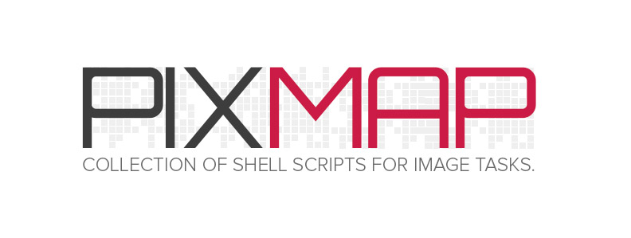

# Welcome

> WORK IN PROGRESS...

You might be wondering: "Why did you create this tool, based on an existing one that does the same routines (and even more)?

It is a fact! We have many tools to accomplish tasks that PixMap intends to perform as well. However, in Front End development, the tools most commonly used to deal with images are used as plugins or modules.

I'm talking about Grunt, Gulp and NodeJS. These are some of the tools/technologies used in this universe called Front-End. That, in turn, uses modules and/or plugins to handle these routines focused on images.

But, what they have in common?

I think you already know the answer. They use resources and tools based on Unix Shell.

I use Grunt, Gulp and a lot of NodeJS modules in my projects (and I love it) but, lets be honest, we are installing two or more dependencies, making settings for each project and consuming a lot of time for this. If, on one hand, some of these tools/plugins sin in terms of performance to build, on the other hand, they have an efficient automation of tasks and becomes suitable for development environment.

The "speed" of the execution of a task in the development environment does not matter either. Certainly, wait for a few more seconds is not so bad and this problem can be fixed up with a more appropriate setting or a detailed analysis of the actual scenario.

The main point of PixMap is automate and smooth the Front End routines with an easy and quick way to deal with images. Also, this method was designed to meet certain needs and share another practical method to perform such tasks. Please, before taking any decision, consider carefully the possibilities of improving your workflow with current tools.

Hope you enjoy! :)

> **IMPORTANT:** This program can only be run on *nix systems. Soon I will be suiting for Windows too.

## Requirements

- [ImageMagick](http://www.imagemagick.org)

**MAC INSTALL:**

    # Using brew
    $ brew uninstall imagemagick && brew update && brew cleanup && brew doctor
    $ brew install imagemagick

    # Using MacPorts
    $ port uninstall imagemagick
    $ port selfupdate

**LINUX INSTALL:**

    # Using apt-get
    $ sudo apt-get install imagemagick

## What is included?

- Sprite Generator
- DataURI Generator
- Image Type Conversion

## Getting Started

### Sprite Generator
    # 1. Run PixMap
    $ ./pixmap.sh sprite

    # 2. Select "Sprite" option

    # 3. Input the name of file

### DataURI Generator
    # 1. Run PixMap
    $ ./pixmap.sh datauri

    # 2. Select "DataURI" option

    # 3. Input the name of file

    # 4. Paste in your CSS

### Image Type Conversion
    # 1. Run PixMap
    $ ./pixmap.sh convert

    # 2. Select "Convert" option

    # 3. Input the name of file

> Important: all scripts can be executed in stand alone mode. Just place it in your system path, make it executable and run it. Remember, it's up to you do this. I suppose you know what you are doing when performing this procedure.
